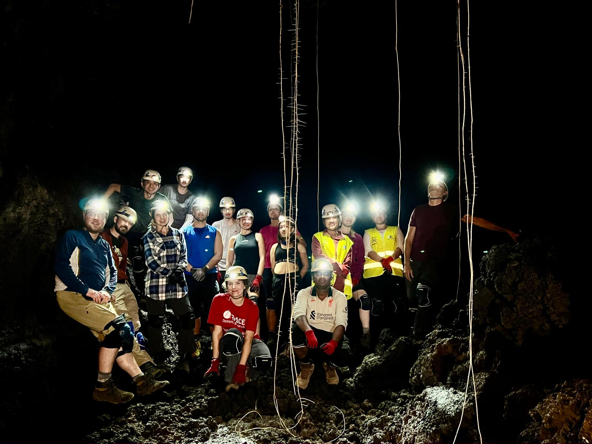

# 🌋 Living the Volcano Nerd Dream: My Tenerife VolcanoCamp Experience

## **November 2025: Geophysics in the Canary Islands**

In November 2025, the first week, I got to live the **volcano nerd dream**. I scored a scholarship from **GeoTenerife Ltd** and dove into their **VolcanoCamp** on **Tenerife, Canary Islands** in Spain. This experience was focused on intensive field training in volcanic mapping, stratigraphy, and eruption dynamics.

One week on a volcanic island sounds fun already, but spending that week crawling around real lava fields, mapping cones, and reading the landscape like a detective? Honestly, I was in my happiest element.

  
  
  
  

---

## **🔬 Field Geology **

We weren’t just wandering around, pointing at cool rocks. We were doing proper field geology, mapping flow units, sketching volcanic facies, checking crystal textures, figuring out eruption sequences, and trying to make sense of outcrops that looked like geological puzzle boxes. Tenerife has this wild diversity of volcanic environments, so every day felt like flipping to a new chapter in Earth’s diary. We even participated in the IV Vulcana Symposium on submarine volcanology and emergency management.

<table align="center">
  <tr>
    <td></td>
    <td></td>
    <td></td>
    <td></td>
  </tr>
</table>

---

## **🚇 Inside the Earth: The Lava Tube System**

But the moment that absolutely blew my mind? **Entering a lava tube system** that felt like the planet had carved a subway just for us. These tubes were huge, long, tall, branching into multiple merged passages. Standing inside them, you can literally trace how lava once rushed through, insulating itself and forming these enormous conduits.

It’s one thing to read about lava tube morphology; it’s another thing to stand inside one and think, **“Yep, molten rock once sprinted through here at terrifying speed.”** Spectacular doesn’t even cover it.

<table align="center">
  <tr>
    <td></td>
    <td></td>
    <td></td>
   
  </tr>
</table>

---

## **📚 Sharpening the Scientific Edge**

By the end of the week, I felt **sharper in volcanic hazard assessment**, better at interpreting volcanic landforms, and more at ease working with an international group of brilliant, slightly obsessed geoscientists. I learned a lot, but I also laughed a lot, sweated a lot, and remembered exactly why I love this science. It was great to be with an amazing bunch of students, ranging from PhD to bachelor's, and to interact with a huge diversity.

---

## **🙏 Huge Thanks**

Huge thanks to **Sharon Backhouse**, **IGNACIO GARCIA**, and **Alexis Schwartz** for making the whole experience unforgettable.

